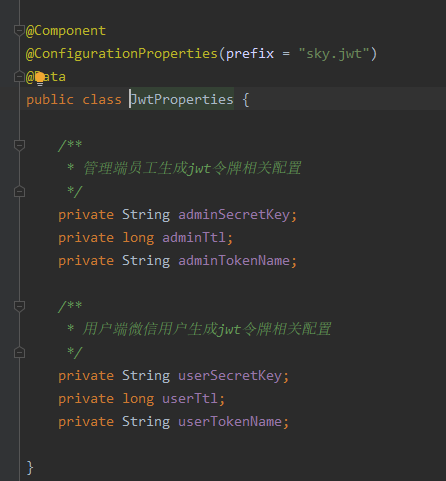
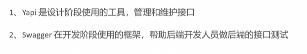
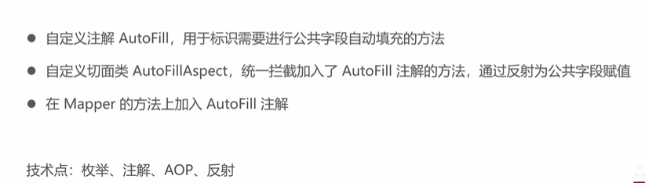
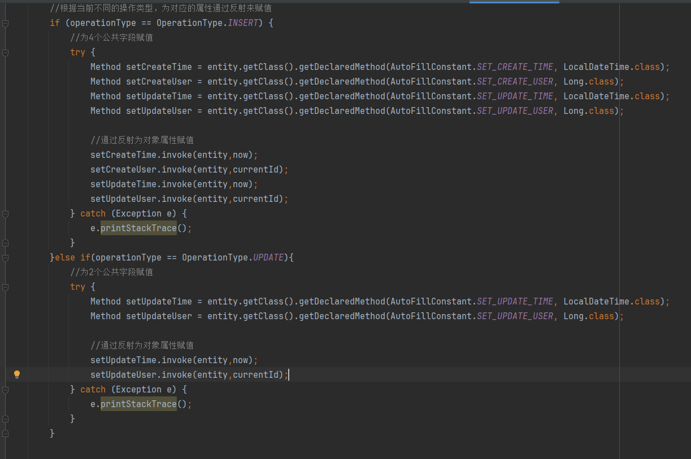
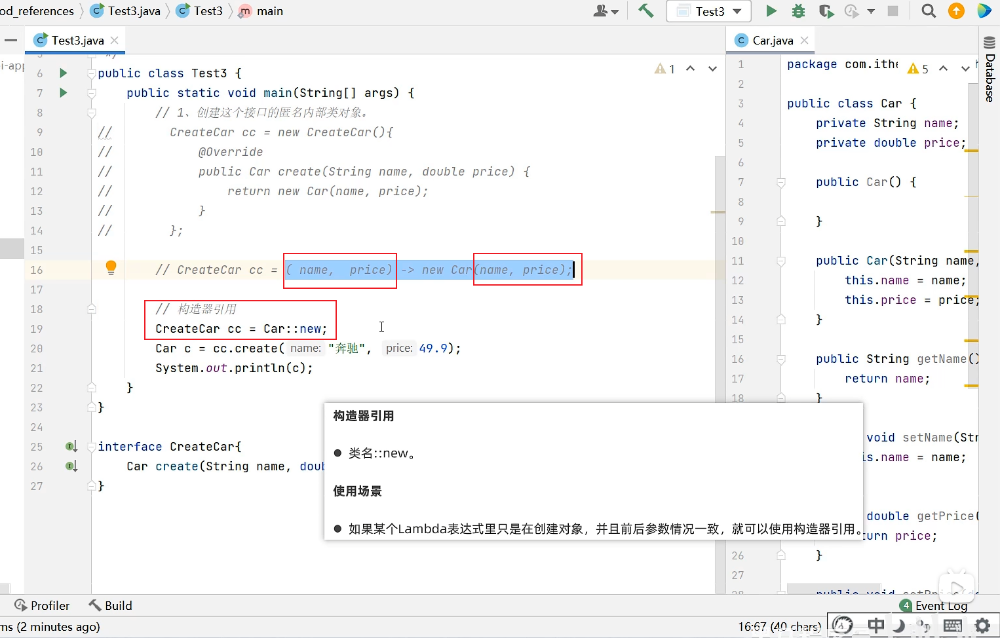

# sky-take-out

#### 介绍


# 

自己的学习笔记，记录学到什么。

## day01

### 1.实体类pojo


### 2.读取yaml文件中的配置

可以通过注解读取配置的属性，再注入就ok





### 3.nginx反向代理的好处

- 提高访问速度
- 进行负载均衡
- 保证后端服务安全


反向代理


负载均衡

### 4.Swagger

之前一直用postman测试接口，Swagger相比postman，可以自动

扫描，不用手动输路径去测试，还可以通过注解标注每个方法，属性。

postman是可以记忆测试的参数，Swagger毕竟是网页打开，很多参数无法保存。


Swagger与Yapi



## day02

### 1.ThreadLocal

ThreadLocal叫做***线程变量***，意思是ThreadLocal中填充的变量属于**当前线程\***，该变量对其他线程而言是隔离的，也就是说该变量是当前线程独有的变量。ThreadLocal为变量在每个线程中都创建了一个副本，那么每个线程可以访问自己内部的副本变量。

项目通过鉴权后用ThreadLocal存储用户的身份信息，后续需要获取用户身份信息就可以直接获取。

**其他应用场景拓展**：线程安全、日志上下文存储、traceld存储、数据库Session、PageHelper分页

**两个作用：**1.解决并发问题。2.在线程中传递数据

### 2.mybatis分页用插件PageHelper

PageHelper也是基于ThreadLocal来保存分页的页数。

### 3.格式化时间

新学到，两种格式化时间方式


### 4.new 对象用Builder建造者模式

用lombok注解@Builder在实体类上就可以用了

使用方式如下图


## day03

### 1.利用aop和反射进行公共字段填充

每个表的公共字段如创建时间，修改时间，创建人等，利用注解和aop实现统一管理




代码




**拓展**：

aop还可以用作日志的记录

### 2.常量交给常量类、枚举管理

### 3.阿里云OSS存储图片

AccessKey ID

```
LTAI5tCYmsLqkrvHxPHKmcfS
```

AccessKey Secret

```
e7McOFAnDEnWXdrcyO80PUqSXq2nBj
```

### 4.可以通过@RequestParam传List

### 5.删除多条数据或者新增，尽量用动态sql提高效率，而不是用java循环

## day04

### 1.自己练习

day04是自己练习，我只写了新增套餐，

学到了在修改的时候可以


## day05

### 1.redis

redis 5大基本类型：

- **字符串（string)：**普通字符串，redis中最简单的数据类型
- **哈希(hash)：**也叫散列，类似java中的HashMap结构
- **列表(list)：**按照插入顺序排序，可以有重复元素，类似java中的LinkedList
- **集合(set)：**无序集合，没有重复元素，类似java中的HashSet
- **有序集合(sorted set/zset)**：集合中每个元素关联一个分数，根据分数升序排序，没有重复元素

## day06

### 1.微信登录

## day07

### 1.查一下缓存穿透、缓存雪崩、缓存击穿

**缓存击穿**：是指当某一key的缓存过期时大并发量的请求同时访问此key，瞬间击穿缓存服务器直接访问数据库，让数据库处于负载的情况。

**缓存穿透**：是指缓存服务器中没有缓存数据，数据库中也没有符合条件的数据，导致业务系统每次都绕过缓存服务器查询下游的数据库，缓存服务器完全失去了其应用的作用。

**缓存雪崩**：是指当大量缓存同时过期或缓存服务宕机，所有请求的都直接访问数据库，造成数据库高负载，影响性能，甚至数据库宕机。

在记忆这几个概念的时候，不要死记硬背，你可以尝试这样记忆：

首先，雪崩的概念比较容易记，就是很多个Key同时过期才会雪崩，"缓存雪崩的时候没有一个Key是无辜的"。至于穿透和击穿，区别在于穿透是"透"，什么叫透呢，那就是不仅缓存被击穿了，数据库也被击穿了，这种才叫透。所以，这种缓存和数据库中都没有的情况叫做"缓存穿透"

### 2.redis来做缓存

用户查到接口的内容时候，可以把接口返回的结果放在redis中，防止多个用户频繁查询数据库，优化查询时间

### 3.Spring Cache


## day08

### 1.微信支付

## day09

### 1.课后作业（没敲）

### 2.可以把一个实体类用一个字段返回

```
@Data
@NoArgsConstructor
@AllArgsConstructor
public class OrderVO extends Orders implements Serializable {

    //订单菜品信息
    private String orderDishes;

    //订单详情
    private List<OrderDetail> orderDetailList;
    }
```

```
    {
        "code":1, "msg":null, "data":{
        "id":11, "number":"1713256492556", "status":6, "userId":4, "addressBookId":2, "orderTime":
        "2024-04-16 16:34", "checkoutTime":null, "payMethod":1, "payStatus":0, "amount":169.00, "remark":"", "userName":
        null, "phone":"15502877777", "address":null, "consignee":"大笨狗", "cancelReason":"用户取消", "rejectionReason":
        null, "cancelTime":"2024-04-17 00:40", "estimatedDeliveryTime":"2024-04-16 17:34", "deliveryStatus":
        0, "deliveryTime":null, "packAmount":2, "tablewareNumber":0, "tablewareStatus":0, "orderDishes":
        null, "orderDetailList":[{
            "id":6, "name":"鮰鱼2斤", "orderId":11, "dishId":67, "setmealId":null, "dishFlavor":"微辣", "number":
            1, "amount":72.00, "image":
            "https://sky-itcast.oss-cn-beijing.aliyuncs.com/8cfcc576-4b66-4a09-ac68-ad5b273c2590.png"
        },{
            "id":7, "name":"馋嘴牛蛙", "orderId":11, "dishId":64, "setmealId":null, "dishFlavor":null, "number":
            1, "amount":89.00, "image":
            "https://take-out-heima.oss-cn-beijing.aliyuncs.com/3d8b7c33-eafb-4494-ad6c-a4313eb09d2c.png"
        }]}
    }
```

### 3.stream流

再来一单接口

## day10

### 1.定时任务 Spring Task


#### 1.cron表达式

[在线Cron表达式生成器 (qqe2.com)](https://cron.qqe2.com/)


#### 2.例子

```
    /**
     * 处理超时订单的方法
     */
    @Scheduled(cron = "0 * * * * ? ") //每分钟触发一次
    public void processTimeoutOrder(){
        log.info("定时处理超时订单：{}", LocalDateTime.now());

        //当前时间减15分钟
        LocalDateTime time = LocalDateTime.now().plusMinutes(-15);
        //查找超过15分钟的订单
        List<Orders> ordersList= orderMapper.getByStatusAndOrderTimeLT(Orders.PENDING_PAYMENT,time);

        //修改订单状态
        if (ordersList !=null && ordersList.size()>0) {
            for (Orders orders : ordersList) {
                orders.setStatus(Orders.CANCELLED);
                orders.setCancelReason("订单超时，自动取消");
                orders.setCancelTime(LocalDateTime.now());
                orderMapper.update(orders);
            }
        }
    }
```

### 2.WebSocket

websocket实现来单提醒和用户催单


## day11

### 1.mapper传参可以直接封装成map传过去读

```
Map map = new HashMap();
map.put("begin",beginTime);
map.put("end",endTime);
map.put("status", Orders.COMPLETED);
Double turnover = orderMapper.sumByMap(map);
```

```
Double sumByMap(Map map);
```

```
    <select id="sumByMap" resultType="java.lang.Double">
        select sum(amount) from orders
        <where>
            <if test="begin !=null">and order_time &gt; #{begin}</if>
            <if test="end !=null">and order_time &lt; #{end}</if>
            <if test="status !=null">and status = #{status}</if>
        </where>
    </select>
```

### 2.Stream流学（忘完了）

stream流可用于操作集合或者数组的数据

**优势**：**Stream流大量的结合了Lambda的语法风格来编程**，提供了一种更加强大，更加简单的方式操作集合或者数组中的数据，代码更简洁，可读性更好。


### 3.Lambda省略规则


### 4.方法引用（进一步简化Lambda表达式）

#### 4.1静态方法引用


#### 4.2实例方法引用

与静态方法引用差不多


#### 4.3特定方法类型引用


**这里compareToIgnoreCase是String提供的方法**


#### 4.4构造器方法引用（开发不常用）




## day12

### 1.Apache POI 

处理office的开源项目


